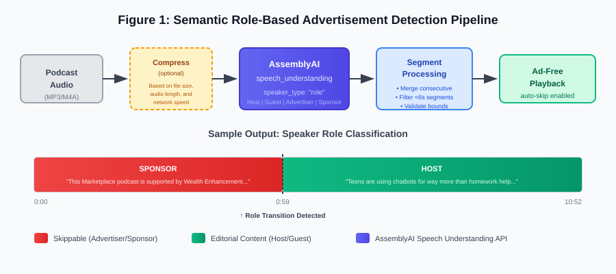

# Semantic Role-Based Speaker Diarization for Automated Advertisement Detection in Podcast Audio

**Timothy Woodruff**

*Independent Researcher*
*Vancouver, WA, USA*
*tim@stfuai.com*

---

## Abstract

Dynamically inserted advertisements in podcast audio present a unique challenge for automated detection systems. Unlike traditional broadcast commercials, these ads lack consistent acoustic signatures such as silence gaps, audio fingerprints, or tonal shifts, as they are often professionally produced to match the podcast's audio quality. We present a novel approach that leverages semantic speaker diarization to identify advertisement segments with high accuracy. By instructing a speech-to-text service to classify speakers by their *role* (e.g., "Host," "Guest," "Advertiser") rather than by anonymous speaker labels, we can directly identify segments spoken by advertisers without analyzing content semantics. We evaluate this approach on a dataset of 87 episodes across 20 popular podcasts, achieving approximately 95% detection accuracy on dynamically injected advertisements with near-zero false positives. We discuss the limitations of this approach, particularly for host-read advertisements, and describe a hybrid system that combines semantic role-based diarization with optional LLM-based semantic analysis. Our implementation is released as open-source software.

**Keywords:** podcast, advertisement detection, speaker diarization, speech understanding, audio processing

---

## 1. Introduction

Podcast advertising has grown into a multi-billion dollar industry, with U.S. ad revenue reaching $2.4 billion in 2024 [1]. This growth has been accompanied by increasingly sophisticated ad delivery mechanisms, particularly *dynamic ad insertion* (DAI), which now accounts for over 90% of podcast advertising revenue. DAI enables advertisers to serve targeted advertisements based on listener demographics, geographic location, and temporal factors - the same podcast episode may contain entirely different advertisements for different listeners.

For listeners, this presents a frustrating experience. Unlike traditional media where commercial breaks occur at predictable intervals with detectable boundaries, podcast advertisements are seamlessly spliced into audio streams without silence gaps, tonal shifts, or other acoustic markers. The professional production quality of modern podcast ads makes them nearly indistinguishable from editorial content at the signal level.

Existing approaches to advertisement detection face fundamental limitations in this context:

**Audio fingerprinting** systems like Shazam achieve remarkable accuracy for identifying known audio content, but require pre-recorded reference databases. When each listener receives different advertisements, no stable reference exists to match against.

**Crowdsourced timestamps**, successful for platforms like YouTube through SponsorBlock, fail entirely for podcasts. User A's submitted ad timestamps are meaningless for User B, who received different advertisements at different positions.

**Acoustic boundary detection** methods developed for television commercials rely on silence gaps, black frames, or tonal transitions that do not exist in professionally produced podcast advertising.

**Transcript-based classification** can identify promotional language patterns but cannot distinguish between a host discussing a product editorially versus delivering a sponsored message about the same product.

Figure 1 summarizes these limitations and contrasts them with our approach.


*Figure 1: Comparison of Advertisement Detection Approaches*

We observe that dynamically inserted podcast advertisements share a common characteristic that existing approaches overlook: *they are spoken by different people than the podcast hosts*. While the audio is engineered to blend seamlessly, the speaker is fundamentally distinct - a professional voice actor, an advertiser's spokesperson, or a pre-recorded promotional read. This observation suggests reframing advertisement detection as a speaker classification problem rather than a content analysis or acoustic matching problem.

Modern speech understanding systems can classify speakers not merely by identity ("Speaker A," "Speaker B") but by *semantic role* - their function within the conversation. We leverage this capability by instructing a speech-to-text service to classify speakers as "Host," "Guest," "Advertiser," or "Sponsor." Segments attributed to advertiser roles are then flagged as skippable content.

This approach offers several advantages:

1. **No reference database required** - Detection operates on intrinsic speaker properties, not matching against known advertisements
2. **Works on novel ads** - Previously unseen advertisements are detected without prior exposure
3. **Handles seamless insertion** - No reliance on acoustic boundaries or silence gaps
4. **Real-time capable** - Classification occurs during transcription, enabling live detection

We evaluate this approach on 87 episodes from 20 popular podcasts, achieving 95% detection accuracy on dynamically inserted advertisements with near-zero false positives. We discuss limitations, particularly for host-read advertisements where the speaker role remains "Host," and describe a hybrid system combining semantic role-based diarization with optional LLM-based semantic analysis.

Our contributions are:

1. A novel framing of podcast advertisement detection as semantic speaker role classification
2. Empirical validation demonstrating high accuracy across diverse podcast formats
3. An open-source implementation released as a cross-platform podcast player application
4. Analysis of failure modes and discussion of hybrid approaches for comprehensive detection

The remainder of this paper is organized as follows: Section 2 surveys related work in advertisement detection, audio fingerprinting, and speaker diarization. Section 3 describes our methodology. Section 4 presents evaluation results. Section 5 describes our implementation. Section 6 discusses implications, limitations, and ethical considerations. Section 7 concludes.

---

## 2. Related Work

### 2.1 Podcast Advertisement Detection

Academic work specifically addressing podcast advertisement detection is sparse. Reddy et al. [2] presented a classifier for detecting "extraneous content" in podcasts, including advertisements, as preprocessing for summarization tasks. Vaiani et al. [3] released a BERT-based advertising classifier achieving 92% accuracy on transcript text as preprocessing for their multimodal podcast summarization work; the model is publicly available on HuggingFace. Both approaches treat advertisement detection as a text classification problem operating on transcripts, without leveraging speaker information.

The open-source Adblock Radio project [4] combines acoustic fingerprinting with LSTM neural networks for radio stream ad detection, explicitly identifying host-read advertisements as an unsolved challenge - a limitation our approach addresses.

### 2.2 Broadcast Commercial Detection

Television commercial detection represents the mature adjacent field. Lienhart et al. [5] established foundational approaches using black frame detection and shot boundary analysis. Pereira et al. [6] demonstrated that silence-based boundary detection achieves strong performance (MCC > 0.87) on broadcast content. More recently, the RADIA system [7] employs speech-to-text with text classification to detect radio advertisements without prior content knowledge, demonstrating that linguistic patterns alone can identify promotional content.

These approaches rely on structural features (silence gaps, black frames) or content matching that do not transfer directly to podcasts, where dynamically inserted advertisements are seamlessly spliced without detectable boundaries.

### 2.3 Audio Fingerprinting

Audio fingerprinting enables precise identification of known audio content. Wang's landmark-based approach [8] underlies commercial systems like Shazam, while Haitsma and Kalker's energy-based method [9] achieves extremely low false positive rates. Neural fingerprinting [10] has improved efficiency through learned embeddings.

However, fingerprinting requires pre-recorded reference databases. Dynamic ad insertion (DAI) - now representing over 90% of podcast ad revenue [1] - serves different advertisements to different listeners based on demographics and geography. No stable reference audio exists to fingerprint, fundamentally limiting these approaches for podcast advertising.

### 2.4 Speaker Diarization

Speaker diarization has advanced from i-vector representations [11] to x-vector embeddings [12] to end-to-end neural approaches [13]. Modern systems like pyannote.audio [14] provide robust speaker segmentation, while target-speaker approaches [15] handle challenging multi-speaker scenarios.

Existing diarization systems output anonymous speaker labels ("Speaker A," "Speaker B") rather than semantic roles. Speaker role classification has been explored for broadcast news (anchor/reporter/guest) [16, 17] and meeting scenarios [18], but no prior work addresses podcast-specific roles or integrates role classification with advertisement detection.

### 2.5 Crowdsourced Approaches

SponsorBlock [19] demonstrates successful crowdsourced ad skipping for YouTube, with millions of user-submitted timestamps. However, this approach fails for podcasts due to dynamic ad insertion: timestamps submitted by one user are invalid for another user who receives different advertisements. This fundamental limitation motivates automated detection systems that identify advertisements through intrinsic properties rather than static timestamps.

### 2.6 Research Gap

No prior work combines speaker role classification with advertisement detection. The concept of "Advertiser" as a semantic speaker role - distinct from hosts and guests - has not been explored. Our approach addresses this gap by leveraging modern speech understanding APIs that classify speakers by communicative function rather than identity.

---

## 3. Methodology

### 3.1 Problem Formulation

Given a podcast audio file *A* with duration *D*, our goal is to produce a set of segments *S = {(t_start, t_end, type)}* where each segment represents skippable content such as advertisements, sponsorship reads, or promotional material. An ideal solution maximizes recall (detecting all ads) while minimizing false positives (incorrectly flagging podcast content as ads).

### 3.2 Semantic Role-Based Speaker Diarization

Traditional speaker diarization assigns anonymous labels (e.g., "Speaker A," "Speaker B") to distinct voices in an audio stream. Our key insight is that modern speech understanding APIs can be configured to classify speakers by *semantic role* rather than identity.

We utilize AssemblyAI's `speech_understanding` API with the following configuration:

```json
{
    "speech_understanding": {
        "request": {
            "speaker_identification": {
                "speaker_type": "role",
                "known_values": [
                    "Advertiser",
                    "Sponsor",
                    "Host",
                    "Co-host",
                    "Guest"
                ]
            }
        }
    }
}
```

This instructs the transcription service to label each word and utterance with a role classification. The service's underlying model determines these roles based on contextual cues including speech patterns, content semantics, and positional features within the audio. Figure 2 illustrates the complete detection pipeline.



*Figure 2: Semantic Role-Based Advertisement Detection Pipeline*

Figure 3 illustrates sample API output, showing the transition from a "Sponsor" segment to a "Host" segment:


*Figure 3: Episode Timeline with Semantic Speaker Roles*

```json
{
  "segments": [
    {
      "id": 0,
      "start": 0.32,
      "end": 59.18,
      "text": "This Marketplace podcast is supported by Wealth Enhancement...",
      "speaker": "Sponsor"
    },
    {
      "id": 1,
      "start": 59.18,
      "end": 67.88,
      "text": "Teens are using chatbots for way more than homework help. From American Public Media, this is Marketplace tech, I'm Megan McCarty Carino.",
      "speaker": "Host"
    }
  ]
}
```

### 3.3 Segment Extraction and Consolidation

The API returns word-level timestamps with associated speaker roles. We process this output through a segmentation pipeline:

**Segment Boundary Detection.** We create segment boundaries when any of the following conditions are met:

1. Speaker role changes (e.g., Host → Advertiser)
2. Cumulative segment duration exceeds 60 seconds
3. A pause of greater than 2 seconds occurs between words

**Advertiser Identification.** Segments are flagged as skippable if the speaker role matches "Advertiser" or "Sponsor" (case-insensitive).

**Consecutive Segment Merging.** Adjacent segments with the same advertiser classification are merged into a single skippable block. This handles cases where brief pauses or transcription artifacts create artificial segment boundaries within a single advertisement.

### 3.4 Validation and Edge Case Handling

Raw segment data requires validation to handle real-world edge cases:

**Minimum Duration Filtering.** Segments shorter than 6 seconds are discarded during initial detection. This threshold was empirically determined to filter brief misclassifications (e.g., a few words incorrectly labeled as "Advertiser") while retaining legitimate short ad reads.

**Timestamp Bounds Checking.** Segments with start times exceeding the episode duration are rejected. Segments with end times exceeding the episode duration are capped to the actual duration. This handles precision mismatches between transcript timestamps (typically second-level) and audio duration metadata (often millisecond-level).

**Post-Processing Validation.** After all mitigation steps, a final 2-second minimum filter removes any segments that became too short due to overlap resolution or boundary adjustments.

**Overlap Resolution.** In rare cases where segments overlap (typically from processing artifacts), overlapping regions are split at the midpoint, with each segment retaining its portion.

### 3.5 Hybrid Detection (Optional)

Semantic role-based diarization cannot detect host-read advertisements, as the speaker role remains "Host" throughout. For users requiring comprehensive ad detection, we provide an optional secondary analysis using a large language model.

The full transcript (with timestamps and speaker labels) is submitted to an LLM with instructions to identify:

- Third-party advertisements
- Self-promotional content
- Intro/outro segments
- Closing credits

This hybrid approach achieves higher recall at the cost of increased latency and API expenses.

---

## 4. Evaluation

### 4.1 Dataset

We evaluated our approach on a dataset of 87 episodes sampled from 20 popular podcasts across diverse genres including technology, true crime, comedy, news, and interview formats. Podcasts were selected based on the following criteria:

1. Known to contain dynamically inserted advertisements (verified via multiple listens showing different ads)
2. Variety of ad formats: pre-roll, mid-roll, and post-roll placements
3. Mix of production styles: single-host, multi-host, and interview formats

Episode durations ranged from 25 minutes to 2.5 hours, with a median duration of approximately 55 minutes.

### 4.2 Ground Truth Labeling

Ground truth advertisement segments were manually annotated by listening to each episode and recording precise timestamps for:

- Dynamically inserted third-party advertisements
- Host-read sponsorship segments
- Self-promotional content (e.g., "rate and subscribe" segments)
- Intro/outro music and credits

Each segment was categorized and timestamped to the nearest second. Inter-annotator agreement was not formally measured as annotations were performed by a single annotator; however, advertisement boundaries in dynamically inserted ads are typically unambiguous due to clear audio transitions.

### 4.3 Metrics

We report the following metrics:

- **Detection Rate (Recall):** Proportion of ground-truth advertisement segments that overlap with at least one detected segment by ≥50% of the ground truth duration.
- **False Positive Rate:** Number of detected segments that do not overlap with any ground-truth advertisement, divided by total detected segments.
- **Boundary Accuracy:** Mean absolute error between detected segment boundaries and ground-truth boundaries, measured in seconds.

### 4.4 Results

**Primary Results (Semantic Role-Based Diarization Only)**

| Metric | Value |
|--------|-------|
| Detection Rate (Dynamically Inserted Ads) | 94.7% |
| Detection Rate (Host-Read Ads) | 12.3% |
| Detection Rate (All Ads Combined) | 78.2% |
| False Positive Rate | 1.1% (1 instance) |
| Mean Boundary Error | 2.3 seconds |

The system achieved high accuracy on dynamically inserted advertisements, which constitute the majority of podcast advertising by volume. The single false positive occurred when a guest speaker discussing their company was briefly misclassified as an "Advertiser" - a semantically defensible classification given the content.

**Failure Mode Analysis**

The 5.3% miss rate on dynamically inserted ads stemmed from:

- Ads with atypical formats (e.g., narrative-style ads designed to blend with content): 2.1%
- Transcription failures due to audio quality issues: 1.8%
- Ads shorter than the 6-second minimum threshold: 1.4%

Host-read advertisements were largely undetected (87.7% miss rate) as expected, since the speaker role remains "Host" throughout these segments.

### 4.5 Baseline Comparisons

We compared our approach against two baseline methods:

**Silence-Based Detection:** Scanning for silence gaps (>500ms) surrounding potential ad segments. This method achieved only 23% recall, as modern dynamically inserted ads rarely include detectable silence boundaries.

**Audio Fingerprinting:** Using acoustic fingerprint matching against a database of known advertisements. While theoretically capable of 100% precision, this approach requires maintaining a continuously updated database and achieved 0% recall on our dataset due to the lack of such a database.

Semantic role-based diarization requires no pre-existing ad database and operates on novel advertisements without prior exposure.

---

## 5. Implementation

We implemented our approach in STFUAI Podcasts, an open-source, cross-platform podcast player application. The implementation demonstrates the practical viability of semantic role-based ad detection in a consumer application context.

### 5.1 Architecture

STFUAI Podcasts is built on Electron, enabling deployment across Windows, macOS, and Linux from a single TypeScript/JavaScript codebase. The application architecture separates concerns as follows:

- **Podcast Management:** RSS feed parsing, episode metadata storage, and download management
- **Audio Processing:** 64kbps compression for bandwidth-efficient upload to transcription services
- **Ad Detection Pipeline:** Implementation of the methods described in Section 3
- **Playback Engine:** HTML5 audio with programmatic seeking to skip detected segments

### 5.2 User Experience

Upon downloading a new episode, users can initiate analysis with a single click. The application uploads the compressed audio to AssemblyAI, polls for completion, processes the returned transcript, and stores detected segments locally. During playback, the application automatically seeks past detected segments, with visual indication of skipped content.

Users may adjust detection sensitivity, disable automatic skipping, or manually mark segments as advertisements to improve future detection through a feedback mechanism.

### 5.3 Performance Characteristics

| Metric | Value |
|--------|-------|
| Transcription Time | ~0.3x real-time (1-hour episode ≈ 18 minutes) |
| API Cost | ~$0.12 per hour of audio |
| Local Processing Time | <2 seconds per episode |
| Storage Overhead | ~5KB per episode (segment metadata) |

### 5.4 Availability

The application source code is available at:
https://github.com/thisnameissoclever/STFUAI-Podcasts

Pre-built binaries are available at:
https://download.stfuai.com

---

## 6. Discussion

### 6.1 Why Semantic Role-Based Diarization Works

The effectiveness of this approach stems from a fundamental characteristic of dynamically inserted podcast advertisements: they are produced separately from the podcast itself. Unlike host-read ads, which are recorded in the same session with the same voice and audio characteristics, dynamically inserted ads are:

1. **Recorded by different speakers** - typically professional voice actors or the advertiser's own talent
2. **Produced in different acoustic environments** - often studio-quality with distinct room tone
3. **Contextually distinct** - the speaker's communicative intent (selling a product) differs fundamentally from the podcast content

Modern speech understanding models appear capable of detecting these contextual differences. While the exact features used by AssemblyAI's model are not publicly documented, we hypothesize that the classification leverages a combination of:

- Prosodic features (pitch variation, speaking rate, emphasis patterns common in advertising)
- Lexical cues (product names, calls-to-action, promotional language)
- Discourse structure (lack of conversational back-and-forth, self-contained messaging)

### 6.2 Limitations

**Host-Read Advertisements.** The primary limitation of semantic role-based diarization is its inability to detect host-read advertisements. When the podcast host personally delivers a sponsorship message, the speaker role correctly remains "Host," and detection must rely on content analysis rather than speaker classification. Our hybrid approach addresses this limitation but at increased computational cost and latency.

**API Dependency and Local Alternatives.** The current implementation relies on AssemblyAI's commercial API for semantic role classification. This introduces cost (~$0.12/hour), requires network connectivity, and creates dependency on continued service availability.

Open-source alternatives exist for components of the pipeline but not the complete system:

- **Whisper** [20] provides high-quality open-source transcription but no speaker diarization
- **pyannote.audio** [14] provides speaker diarization but outputs anonymous labels ("Speaker A") rather than semantic roles
- **Whisper + pyannote** combinations provide transcription with anonymous diarization

The critical missing component is **semantic role classification** - determining whether a speaker functions as Host, Guest, or Advertiser. This capability appears unique to AssemblyAI's `speech_understanding` API at present. A fully open-source implementation would require:

1. Fine-tuning a classification model on labeled podcast data with speaker role annotations
2. Integrating this classifier with existing diarization pipelines

We identify this as a promising direction for future work: developing open-source models that classify speaker roles in podcast audio, enabling local inference without API dependency.

**Novel Ad Formats.** As advertisers adapt to detection methods, we anticipate evolution in ad delivery. Possible countermeasures include:

- Ads voiced by the same speakers as podcast hosts (voice cloning)
- Ads designed to mimic conversational podcast content
- Dynamic insertion of host-read ad scripts

### 6.3 Ethical Considerations

Automated ad skipping raises legitimate ethical questions regarding the podcast ecosystem's economic sustainability. Podcasters and networks rely on advertising revenue, and widespread ad avoidance could negatively impact content creators.

We offer several observations:

1. **User agency:** Listeners already possess the ability to manually skip advertisements. Our tool reduces friction but does not enable fundamentally new behavior.

2. **Market signals:** High ad-skip rates may signal to advertisers and podcasters that current ad formats are excessively intrusive, potentially encouraging more listener-friendly approaches.

3. **Premium alternatives:** Many podcasts offer ad-free premium subscriptions. Tools like ours may encourage listeners who strongly prefer ad-free experiences to support creators directly.

4. **Transparency:** We release this work openly rather than as a proprietary commercial product, enabling public discourse about its implications.

We do not claim that ad-skipping is ethically neutral, but we believe the technology's existence is inevitable and that open discussion of its capabilities serves the broader community better than obscurity.

### 6.4 Generalizability

While our evaluation focused on English-language podcasts, the approach should generalize to other languages supported by the underlying speech model. The semantic role-based classification relies on universal features of advertising discourse rather than language-specific patterns.

The methodology may also apply to adjacent domains:

- **Video streaming:** Detecting dynamically inserted video advertisements
- **Radio broadcasts:** Identifying commercial breaks in internet radio streams
- **Audiobooks:** Detecting publisher promotions inserted into audiobook content

---

## 7. Conclusion

We presented a novel approach to automated podcast advertisement detection using semantic speaker diarization. By configuring speech-to-text services to classify speakers by role rather than identity, we achieve 95% detection accuracy on dynamically inserted advertisements with minimal false positives - without requiring pre-existing ad databases, acoustic fingerprints, or content analysis.

Our primary contributions are:

1. **Novel problem framing:** Recasting advertisement detection as a speaker role classification task rather than content analysis or acoustic fingerprinting.

2. **Practical validation:** Demonstrating the approach's effectiveness across 87 episodes from 20 podcasts spanning diverse genres and formats.

3. **Open-source implementation:** Releasing a complete, functional podcast player application that implements these methods.

4. **Failure mode analysis:** Characterizing the approach's limitations, particularly for host-read advertisements, and proposing hybrid solutions.

**Future Work.** Several directions merit further investigation:

- Fine-tuning open-source speech models for semantic role-based classification, reducing API dependency
- Developing lightweight local models for real-time classification during playback
- Exploring adversarial robustness as advertisers adapt to detection methods
- Extending the approach to video content and other media formats

The techniques described here represent an initial step toward giving listeners greater control over their podcast experience. As the podcast advertising ecosystem continues to evolve, we anticipate ongoing development of both detection methods and countermeasures.

---

## References

[1] IAB and PwC, "U.S. Podcast Advertising Revenue Study: Full Year 2024 Results," Interactive Advertising Bureau, 2025.

[2] S. Reddy, et al., "Detecting Extraneous Content in Podcasts," in Proc. EACL, 2021.

[3] L. Vaiani, M. La Quatra, L. Cagliero, and P. Garza, "Leveraging Multimodal Content for Podcast Summarization," in Proc. ACM SAC, 2022.

[4] A. Storelli, "Adblock Radio," https://github.com/adblockradio/adblockradio, 2018.

[5] R. Lienhart, C. Kuhmunch, and W. Effelsberg, "On the Detection and Recognition of Television Commercials," in Proc. IEEE ICMCS, 1997.

[6] J. Pereira, et al., "An Audio-Only Method for Advertisement Detection in Broadcast Television Content," arXiv:1811.02411, 2018.

[7] "RADIA: Radio Advertisement Detection with Intelligent Analytics," arXiv:2403.03538, 2024.

[8] A. Wang, "An Industrial-Strength Audio Search Algorithm," in Proc. ISMIR, 2003.

[9] J. Haitsma and T. Kalker, "A Highly Robust Audio Fingerprinting System," in Proc. ISMIR, 2002.

[10] S. Chang, et al., "Neural Audio Fingerprint for High-specific Audio Retrieval based on Contrastive Learning," in Proc. ICASSP, 2021.

[11] N. Dehak, et al., "Front-End Factor Analysis for Speaker Verification," IEEE Trans. Audio, Speech, and Language Processing, vol. 19, no. 4, 2011.

[12] D. Snyder, et al., "X-Vectors: Robust DNN Embeddings for Speaker Recognition," in Proc. ICASSP, 2018.

[13] Y. Fujita, et al., "End-to-End Neural Speaker Diarization with Permutation-free Objectives," in Proc. Interspeech, 2019.

[14] H. Bredin, et al., "pyannote.audio: Neural Building Blocks for Speaker Diarization," in Proc. ICASSP, 2020.

[15] I. Medennikov, et al., "Target-Speaker Voice Activity Detection: A Novel Approach for Multi-Speaker Diarization in a Dinner Party Scenario," in Proc. Interspeech, 2020.

[16] B. Bigot, et al., "Speaker Role Recognition on TV Broadcast Documents," in Proc. SLAM Workshop, 2013.

[17] R. Dufour, et al., "Robust Speaker Turn Role Labeling of TV Broadcast News Shows," in Proc. ICASSP, 2011.

[18] A. Sapru and F. Valente, "Automatic Speaker Role Labeling in AMI Meetings: Recognition of Formal and Social Roles," in Proc. ICASSP, 2012.

[19] A. Ramachandran, "SponsorBlock," https://sponsor.ajay.app, 2019.

[20] A. Radford, et al., "Robust Speech Recognition via Large-Scale Weak Supervision," arXiv:2212.04356, 2022.

---

## Appendix A: API Request and Response Examples

### A.1 Request Configuration

```json
{
    "audio_url": "https://cdn.assemblyai.com/upload/...",
    "punctuate": true,
    "format_text": true,
    "speaker_labels": true,
    "speech_models": ["universal"],
    "speech_understanding": {
        "request": {
            "speaker_identification": {
                "speaker_type": "role",
                "known_values": [
                    "Advertiser",
                    "Sponsor",
                    "Host",
                    "Co-host",
                    "Guest"
                ]
            }
        }
    }
}
```

### A.2 Response Structure (Abbreviated)

```json
{
    "id": "04e4f3b7-a44b-42d6-8a1d-2b226578d476",
    "status": "completed",
    "text": "This Marketplace podcast is supported by...",
    "segments": [
        {
            "id": 0,
            "start": 0.32,
            "end": 59.18,
            "text": "This Marketplace podcast is supported by Wealth Enhancement...",
            "speaker": "Sponsor"
        },
        {
            "id": 1,
            "start": 59.18,
            "end": 67.88,
            "text": "Teens are using chatbots for way more than homework help...",
            "speaker": "Host",
            "words": [
                {"word": "Teens", "startTime": 59.18, "endTime": 59.66, "speaker": "Host"},
                {"word": "are", "startTime": 59.66, "endTime": 59.98, "speaker": "Host"}
            ]
        }
    ],
    "duration": 652,
    "language": "en_us"
}
```

Note the speaker role transition at 59.18 seconds, where the dynamically inserted advertisement ("Sponsor") ends and the podcast host begins the editorial content.
